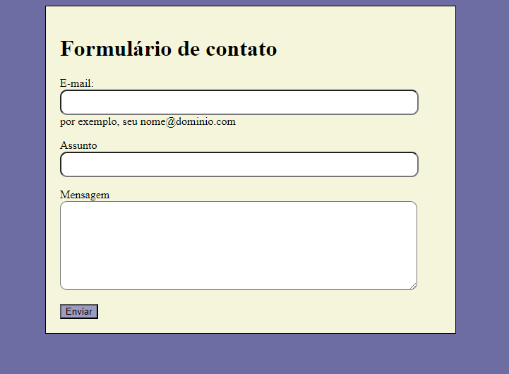

# índice

* [span](#span)
* [label](#label)
* [form](#form)
* [input](#input)
* [button](#button)

## form
Este elemento define um formulário. É um elemento de container como um elemento &lt;div&gt; ou &lt;p&gt; , mas ele também suporta alguns atributos específicos para configurar a forma como o formulário se comporta

| Atributo | Descrição |
|-----:|-----------|
|     method| Este atributo define qual o método HTTP para enviar os dados (ele pode ser "GET" ou "POST"|
|     action| Este atributo define o local (uma URL) em que os dados recolhidos do formulário devem ser enviados.|

## label

Representa uma legenda para um item em uma interface de usuário. Conta com o seguinte atributo:

| Atributo | Descrição |
|-----:|-----------|
| for | O ID de um elemento de formulário relacionados com labelable no mesmo documento como o elemento label.|

## label 
O valor do foratributo deve ser único idpara um elemento rotulável relacionado ao formulário no mesmo documento que o <label>elemento.

## Input> types

O modo como um &lt;input&gt; funciona varia consideravelmente dependendo do valor de seu atributo type, portanto, os diferentes tipos são abordados em suas próprias páginas de referência seperadas. Caso este atributo não seja especificado, o tipo padrão adotado é texto.

# Span

O elemento HTML &lt;span&gt; é um contêiner embutido genérico para frasear conteúdo, que não representa nada inerentemente. Ele pode ser usado para agrupar elementos para fins de estilo (usando os atributos class ou id) ou porque eles compartilham valores de atributos, como lang. Deve ser usado somente quando nenhum outro elemento semântico for apropriado. &lt;span&gt; é muito parecido com um elemento &lt;div&gt;, mas &lt;div&gt; é um elemento de nível de bloco, enquanto &lt;span&gt; é um elemento de nível embutido.

# Textarea

O elemento HTML &lt;textarea&gt; representa um controle de edição de texto simples de múltiplas linhas, útil quando você deseja permitir que os usuários insiram uma quantidade considerável de texto em formato livre, por exemplo, um comentário em um formulário de revisão ou feedback.

# Button

O elemento HTML &lt;button&gt; é um elemento interativo ativado por um usuário com mouse, teclado, dedo, comando de voz ou outra tecnologia assistiva. Uma vez ativado, ele executa uma ação, como enviar um formulário ou abrir uma caixa de diálogo.

