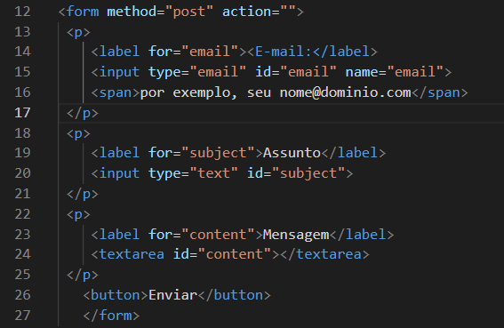

# índice

* [span](#span)
* [label](#label)
* [form](#form)
* [input](#input)
* [button](#button)

## form
O método HTTP para enviar o formulário. Os únicos métodos/valores permitidos são (sem distinção entre maiúsculas e minúsculas):

    * method - Falar do método aqui 

## label action
A URL que processa o envio do formulário. Este valor pode ser substituído por um atributo formaction em um elemento <button>, <input type="submit"> ou <input type="image">. Este atributo é ignorado quando method="dialog" é definido.

## label form
O valor do foratributo deve ser único idpara um elemento rotulável relacionado ao formulário no mesmo documento que o <label>elemento. Portanto, qualquer labelelemento pode ser associado a apenas um controle de formulário.

## input type
O modo como um <input>funciona varia consideravelmente dependendo do valor de seu typeatributo, portanto, os diferentes tipos são abordados em suas próprias páginas de referência separadas. Caso este atributo não seja especificado, o tipo padrão adotado é text.

## span
O elemento HTML é um contêiner embutido genérico para expressar conteúdo, que não representa nada inerentemente. Ele pode ser usado para agrupar elementos para fins de estilo (usando os atributos ou ) ou porque eles compartilham valores de atributos, como . Deve ser usado somente quando nenhum outro elemento semântico for apropriado. é muito parecido com um elemento, mas é um elemento de nível de bloco , enquanto a é um elemento de nível embutido . classidlang

## textarea
Um idatributo para permitir que <textarea>seja associado a um <label>elemento para fins de acessibilidade

## button
 <form>elemento ao qual associar o botão (seu formulário proprietário ). O valor deste atributo deve ser o idde <form>a no mesmo documento. (Se este atributo não estiver definido, será <button>associado ao seu <form>elemento ancestral, se houver.)

Este atributo permite associar <button>elementos a <form>s em qualquer lugar do documento, não apenas dentro de um <form>. Também pode substituir um <form>elemento ancestral.

## email
Um campo para editar um endereço de e-mail. O valor do campo é validado para estar vazio ou ter um único endereço de e-mail válido antes de ser enviado. As pseudoclasses CSS :valid e :invalid são aplicadas apropriadamente.

## form action
A URL que processa o envio do formulário. Este valor pode ser substituído por um formactionatributo em um elemento <button>, <input type="submit">ou <input type="image">. Este atributo é ignorado quando method="dialog"definido.

## name
O nome do formulário. O valor não deve ser a string vazia e deve ser único entre os formelementos da coleção de formulários em que está, se houver.

### id
O atributo global define um identificador (ID) que deve ser único em todo o documento. Sua finalidade é identificar o elemento ao vincular (usando um identificador de fragmento ), criar scripts ou estilizar (com CSS ).id

## form post
O método POST; dados do formulário enviados como o corpo da solicitação.

## emil 
linha 12

